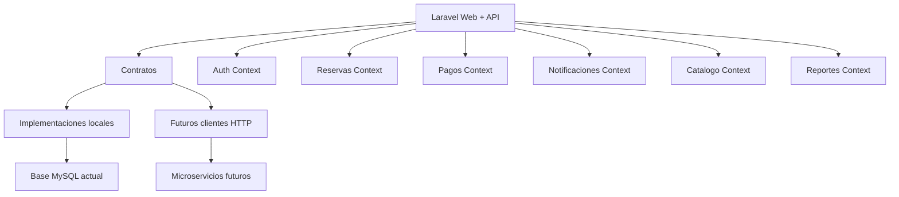

# Preparacion del sistema para microservicios

## Objetivo

El proyecto sigue funcionando como un monolito Laravel, pero queda preparado como monolito modular. Esto permite extraer servicios en el futuro sin romper la web actual, la API REST, Postman, reservas, pagos ni autenticacion.

La estrategia aplicada fue conservadora:

- No se separo la aplicacion en procesos independientes todavia.
- No se cambio la base de datos actual.
- No se cambio el flujo web de cliente, empleado, supervisor ni admin.
- Se agregaron limites de contexto, contratos e indicadores de extraccion.

## Estado actual

El sistema es un monolito Laravel con:

- `routes/web.php`: vistas Blade y flujos web.
- `routes/api.php`: API REST versionada en `/api/v1`.
- `app/Http/Controllers`: controladores web y API.
- `app/Models`: modelos Eloquent compartidos.
- `app/Services`: servicios de negocio ya separados parcialmente.
- `database/sql/spa_mascotas_base.sql`: base principal del sistema.
- `database/migrations`: ajustes incrementales.

## Contextos definidos

Se agrego `config/microservices.php` con el mapa de dominios. Cada contexto tiene prefijos de ruta, modelos principales, cola sugerida, conexion futura y URL opcional de microservicio.

| Contexto | Responsabilidad | Prioridad de extraccion |
| --- | --- | --- |
| `pagos` | Pagos, boletas, comprobantes y notificaciones de pago | 1 |
| `notificaciones` | Correos, alertas, MFA y avisos internos | 1 |
| `auth` | Login, JWT, MFA y roles | 2 |
| `reportes` | Ingresos, metricas y Excel | 2 |
| `reservas` | Citas, horarios, disponibilidad y atenciones | 3 |
| `mascotas` | Mascotas, razas e imagenes | 4 |
| `catalogo` | Servicios, precios e imagenes | 4 |
| `clientes` | Perfil de cliente y datos personales | 5 |
| `empleados` | Turnos, novedades, bandeja y panel del dia | 6 |
| `admin` | Administracion transversal | 7 |

## Cambios tecnicos realizados

### 1. Configuracion de arquitectura

Archivo:

```text
config/microservices.php
```

Variables nuevas en `.env.example`:

```env
PET_ARCHITECTURE_MODE=modular_monolith
PET_SERVICE_TIMEOUT=10
PET_SERVICE_RETRIES=2
AUTH_SERVICE_URL=
CLIENTES_SERVICE_URL=
MASCOTAS_SERVICE_URL=
CATALOGO_SERVICE_URL=
RESERVAS_SERVICE_URL=
PAGOS_SERVICE_URL=
NOTIFICACIONES_SERVICE_URL=
EMPLEADOS_SERVICE_URL=
REPORTES_SERVICE_URL=
ADMIN_SERVICE_URL=
```

Mientras `PET_ARCHITECTURE_MODE=modular_monolith`, todo sigue corriendo dentro de Laravel.

### 2. Mapa de contextos

Archivo:

```text
app/Architecture/ContextMap.php
```

Sirve para consultar:

- modo de arquitectura,
- contextos disponibles,
- URL de un futuro microservicio,
- orden recomendado de extraccion,
- si un contexto esta local o remoto.

### 3. Contratos para futuras extracciones

Se agregaron contratos:

```text
app/Contracts/Auth/TokenIssuer.php
app/Contracts/Reservations/AvailabilityProvider.php
app/Contracts/Security/SecurityAlertReporter.php
```

Y se conectaron con las implementaciones actuales:

```text
App\Contracts\Auth\TokenIssuer
  -> App\Services\Auth\JwtService

App\Contracts\Reservations\AvailabilityProvider
  -> App\Services\Reservas\ReservationAvailabilityService

App\Contracts\Security\SecurityAlertReporter
  -> App\Services\Security\SecurityAlertService
```

Esto significa que mas adelante se podria cambiar, por ejemplo:

```text
ReservationAvailabilityService local
```

por:

```text
ReservationAvailabilityHttpClient
```

sin cambiar los controladores.

### 4. Inyeccion por interfaz

Se ajustaron puntos criticos para depender de contratos:

- `AuthenticateJwt`
- `EnsureUserHasRole`
- `ReservaApiController`
- `AuthApiController`
- `AuthController`

Esto reduce acoplamiento y prepara el sistema para clientes remotos.

### 5. Comando de auditoria

Se agrego:

```bash
php artisan architecture:contexts
```

Muestra los contextos del sistema, si estan en modo local o remoto, su URL futura, cola sugerida y prioridad.

Tambien se puede ejecutar:

```bash
php artisan architecture:contexts --json
```

## Diagrama de arquitectura preparada



## Orden recomendado para convertir a microservicios reales

### Fase 1: Notificaciones

Extraer:

- envio de correos,
- MFA,
- alertas de seguridad,
- notificaciones internas.

Motivo:

- tiene alta independencia,
- puede trabajar por colas,
- reduce carga del monolito.

### Fase 2: Pagos y boletas

Extraer:

- pagos,
- comprobantes,
- boletas,
- notificaciones de pago.

Motivo:

- es un modulo critico,
- puede integrarse con pasarelas reales,
- necesita auditoria propia.

### Fase 3: Reportes

Extraer:

- ingresos,
- metricas,
- Excel,
- dashboards.

Motivo:

- consume datos,
- no deberia bloquear reservas o pagos,
- puede leer desde replicas o eventos.

### Fase 4: Reservas

Extraer:

- disponibilidad,
- calendario,
- asignacion de empleados,
- atenciones.

Motivo:

- es nucleo del negocio,
- requiere mas cuidado,
- depende de clientes, mascotas, servicios y empleados.

### Fase 5: Catalogo y mascotas

Extraer:

- servicios,
- imagenes,
- razas,
- catalogo publico.

Motivo:

- tiene lectura frecuente,
- se puede cachear,
- es buen candidato para API independiente.

## Reglas para no romper el sistema

1. No mover controladores web todavia.
2. No separar base de datos hasta tener eventos o sincronizacion.
3. No llamar HTTP interno si el servicio sigue local.
4. Todo microservicio futuro debe conservar contrato JSON.
5. Cada modulo debe tener pruebas antes de extraerse.
6. Las rutas API deben mantener versionado `/api/v1`.
7. Los roles y JWT deben quedar centralizados en Auth.

## Recomendacion final

El sistema ya queda preparado como monolito modular orientado a microservicios. La siguiente mejora segura seria crear casos de uso por dominio, por ejemplo:

```text
app/Domains/Reservas/Actions/CreateReservation.php
app/Domains/Pagos/Actions/RegisterPayment.php
app/Domains/Notificaciones/Actions/SendMfaCode.php
```

Ese seria el siguiente paso antes de extraer procesos reales.
